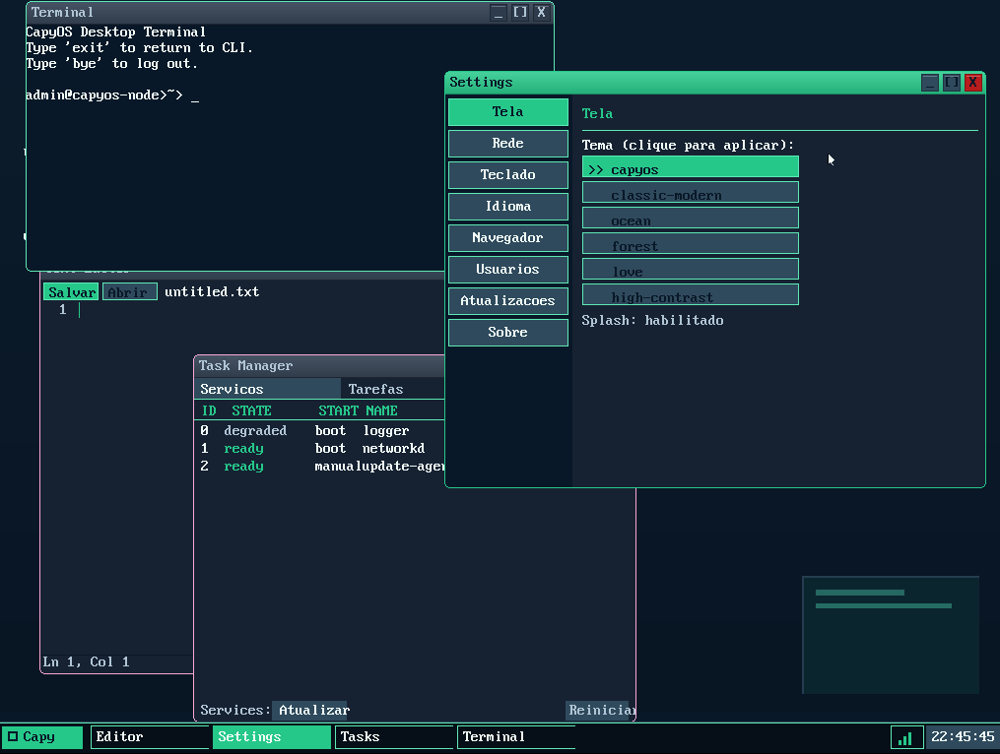

# CapyOS


CapyOS e um sistema operacional experimental, open source, focado na trilha
`UEFI/GPT/x86_64`. O projeto implementa boot UEFI, kernel proprio, desktop
grafico, login, shell, filesystem CAPYFS, rede, criptografia e um pipeline de
release validado por testes automatizados.

Versao de referencia: `0.8.0-alpha.244` (build `0.8.0-alpha.244+20260520`; canal `alpha`; ver `VERSION.yaml`)

## Destaques

- Boot UEFI x86_64 com imagem ISO e disco GPT provisionado.
- Desktop CapyUI com login grafico, taskbar, janelas, apps e terminal.
- Persistencia em disco com CAPYFS e volume `DATA` cifrado.
- CapyCLI com comandos de arquivos, sessao, rede, diagnostico e pacotes.
- Pilha de rede x64 com `E1000`, IPv4, ICMP, TCP, DNS e HTTP/HTTPS.
- Adaptador `capypkg` para receber pacotes Capy remotos verificados
  (SHA-256 + Ed25519 sobre descritor canonico) via `capysh`.
- Gates de release com testes de host, build x64, ISO UEFI e smoke QEMU.

## Screenshots



Mais imagens oficiais:

- [Catalogo de screenshots](docs/screenshots/README.md)
- [CapyUI v1.1](docs/screenshots/CapyUI/v1.1/README.md)

## Caminho Suportado

| Area | Estado |
|---|---|
| Arquitetura oficial | `UEFI/GPT/x86_64` |
| VM principal | VMware UEFI com NIC `E1000` |
| VM de laboratorio | QEMU/OVMF com `E1000` |
| BIOS/MBR 32-bit | legado, fora da trilha de release |
| Hyper-V | investigacao, sem suporte oficial |

## Build Rapido

Dependencias principais: `make`, `nasm`, `xorriso`, `gnu-efi` e toolchain
`x86_64-linux-gnu-*` ou `x86_64-elf-*`.

```bash
python3 tools/scripts/check_deps.py --allow-fallback-toolchain
make test
make all64
make iso-uefi
make smoke-x64-iso TOOLCHAIN64=host
```

Para release local mais completa:

```bash
make layout-audit
make version-audit
make boot-perf-baseline-selftest
make smoke-marker-policy-selftest
make verify-release-checksums TOOLCHAIN64=host
```

## Documentacao

- [Visao tecnica do projeto](docs/project-overview.md)
- [Indice da documentacao](docs/README.md)
- [Arquitetura](docs/architecture/system-overview.md)
- [Planos e roadmap](docs/plans/README.md)
- [Status executivo](docs/plans/STATUS.md)
- [Release notes](docs/releases/README.md)
- [Referencia do CapyCLI](docs/reference/cli-reference.md)
- [Checklist de PR e release](docs/testing/pr-and-release-checklist.md)
- [Contratos de integracao cross-repo](docs/reference/integration/README.md)
- [Matriz de compatibilidade cross-repo](docs/reference/integration/compatibility-matrix.md)
- [Runbook de deploy manual de modulos remotos](docs/operations/manual-module-deploy-runbook.md)

## Licenca

CapyOS e distribuido sob a licenca `Apache-2.0`.

- [LICENSE](LICENSE)
- [NOTICE](NOTICE)
- [BRANDING.md](BRANDING.md)
- [LAWFUL_USE.md](LAWFUL_USE.md)

Desenvolvedor principal: Henrique Schwarz Souza Farisco.
