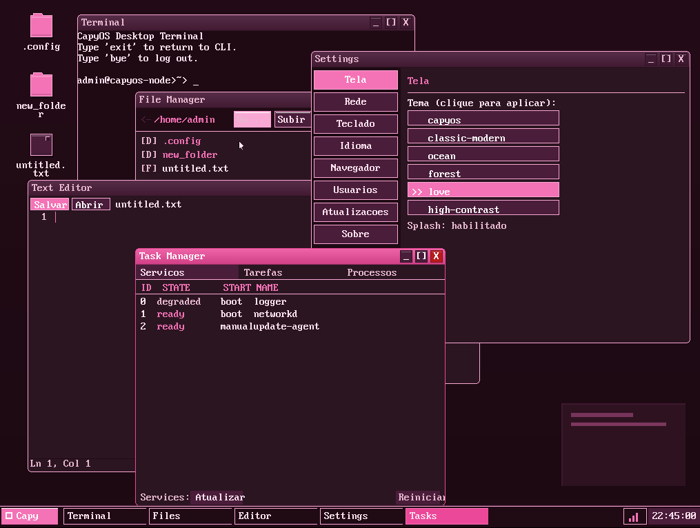
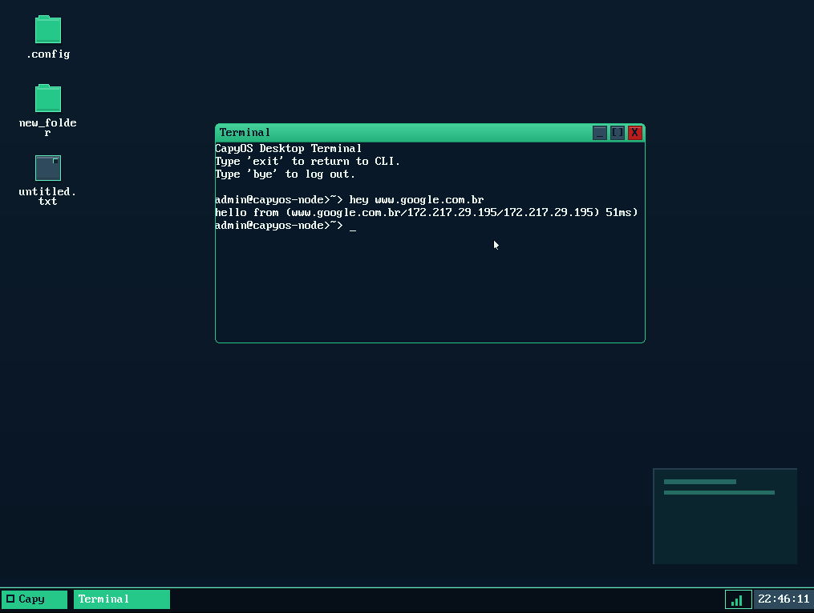
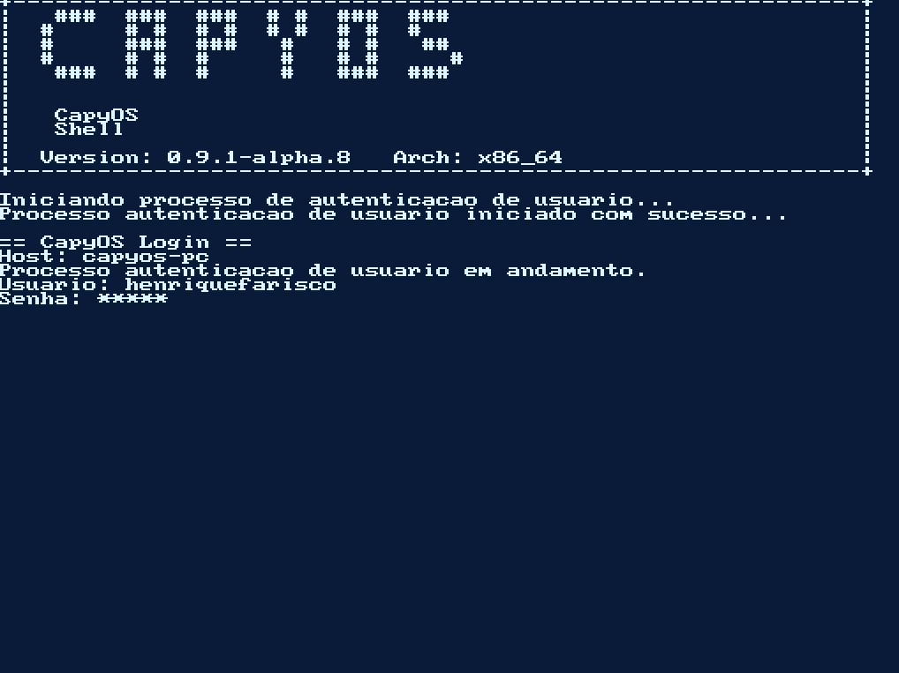
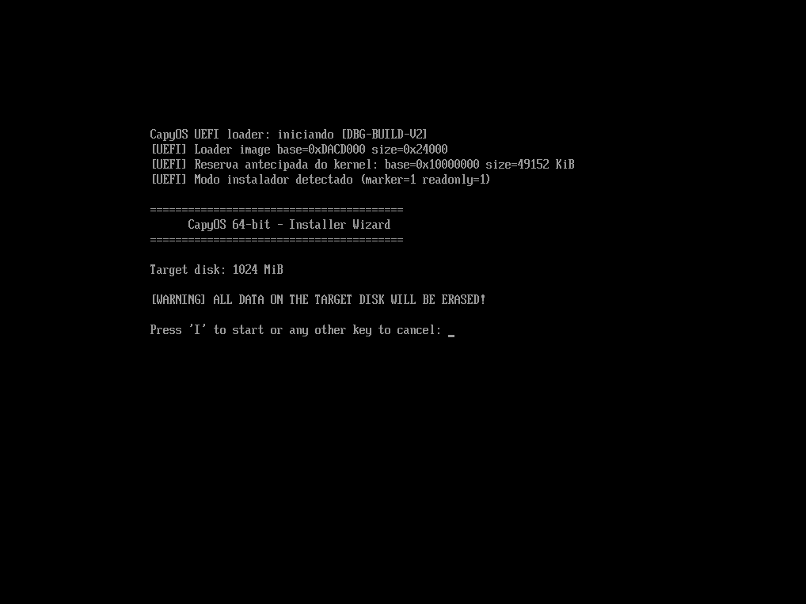

# CapyOS

<p align="center">
  
</p>

Ultima atualizacao: 2026-05-15
Versao de referencia: `0.8.0-alpha.238`
Consolidacao atual de `develop`: M5 userland completo (fork/exec/wait/pipe +
capysh ring 3 + isolamento de crash multi-processo) sobre a base de
robustez ja entregue. O patch atual em `0.8.0-alpha.238` publica
**CapyUI v1.1** como colecao visual oficial no README raiz e remove do
wallpaper do desktop a marca retangular decorativa que parecia um popup vazio.
O patch anterior em `0.8.0-alpha.237` entregou **gate externo `mouse-events`**
para a trilha oficial VMware + UEFI + E1000:
`desktop_mouse_events_smoke_gate_from_readiness()` exige `gui-session`, mouse,
cursor e rotas de mouse prontas, o runtime emite uma unica vez
`[smoke] mouse-events ready`, e `make smoke-x64-vmware-mouse-events` exige DHCP +
`[smoke] gui-session ready` + esse marker no log serial. Os manifestos de
readiness, evidencia, aceitacao e promocao de release tambem passam a exigir o
gate final. O patch anterior em `0.8.0-alpha.236` entregou **gate externo
`gui-session`**. O patch anterior em `0.8.0-alpha.231` entregou **recovery
operacional da migracao legacy -> header-managed** em
`volume_provider_rekey_execute_rollback_step` e
`volume_provider_rekey_execute_cleanup_scratch`. O patch anterior em `0.8.0-alpha.230` entrega
**commit final guardado da migracao legacy -> header-managed**
em `volume_provider_rekey_execute_commit_header`. A nova API aceita somente
`VOLUME_PROVIDER_REKEY_EXEC_FLAG_ALLOW_COMMIT_HEADER`, valida scratch,
checkpoint, header staged e manifest, exige que todos os blocos tenham sido
copiados por `alpha.229`, grava o header Argon2id em LBA0 como ultima escrita
de dados, verifica read-back, abre o volume pelo caminho header-managed e le o
superbloco CAPYFS antes de marcar o checkpoint como `COMPLETED` no scratch.
`tests/test_volume_provider_rekey_commit.c` cobre sucesso com abertura final,
recusa por flag, copia incompleta, falha de escrita de LBA0 e falha de
verificacao. O patch anterior em `0.8.0-alpha.229` entrega
**primeiro copy/re-encrypt reverso incremental da migracao legacy -> header-managed**
em `volume_provider_rekey_execute_copy_step`. A nova API aceita somente
`VOLUME_PROVIDER_REKEY_EXEC_FLAG_ALLOW_COPY_STEP`, le o scratch de `alpha.228`,
valida checkpoint/header/manifest, deriva as chaves legacy e Argon2id do destino,
copia exatamente um bloco em ordem reversa, verifica plaintext pelo dominio
criptografico alvo e so entao atualiza checkpoint + manifest no scratch. Ela
mantinha LBA0 intocado; o commit de header e a abertura verificada entraram na
fatia seguinte. A cobertura de `alpha.229` em
`tests/test_volume_provider_rekey_execute.c` cobre um bloco copiado, recusa por
flag, falha de escrita, falha de verificacao e conclusao do range planejado
mantendo LBA0 intocado.
O patch anterior em `0.8.0-alpha.228` entrega
**staging criptografico do header alvo da migracao legacy -> header-managed**
em `volume_provider_rekey_execute_stage_header`. A API aceita somente
`VOLUME_PROVIDER_REKEY_EXEC_FLAG_ALLOW_STAGED_HEADER_WRITE`, valida o planner,
gera um header alvo Argon2id com salt CSPRNG fresco, computa/verifica
`kdf_check_tag`, serializa checkpoint + header alvo + manifest no bloco scratch
e verifica tudo por read-back/parse/CRC. Ela ainda nao copia blocos, nao
recriptografa dados e nao comita LBA0; o valor entregue e preservar no scratch a
identidade criptografica do destino antes da futura copia reversa. A nova
cobertura em `tests/test_volume_provider_rekey_execute.c` sobe a suite para
staging com sucesso, recusa por flag, falha de escrita, falha de verificacao,
blocked-by-plan, no-op moderno, senha errada fail-closed, roundtrip/tamper do
manifest e prova de que o source block continua intacto. O patch
anterior em `0.8.0-alpha.227` entrega
**primeira etapa write-enabled guardada da migracao legacy -> header-managed**
em `volume_provider_rekey_execute_checkpoint`. A nova API aceita somente
`VOLUME_PROVIDER_REKEY_EXEC_FLAG_ALLOW_SCRATCH_CHECKPOINT_WRITE`, grava o record
persistente de `alpha.226` no bloco scratch calculado pelo planner, le de volta
e parseia para verificar durabilidade/consistencia. Ela ainda nao copia blocos,
nao recriptografa dados e nao comita header; qualquer flag diferente retorna
`WRITES_DISABLED` antes de derivar senha/planejar. O novo modulo
`src/security/volume_provider_rekey_execute.c` evita inflar
`src/security/volume_provider.c`, que permanece no limite de 900 linhas. A nova
cobertura `tests/test_volume_provider_rekey_execute.c` cobre sucesso, recusa sem
flag, plano bloqueado, no-op moderno, falha de escrita, falha de verificacao e
senha errada fail-closed. O patch anterior em `0.8.0-alpha.226` entrega
**contrato persistente de checkpoint para migracao legacy -> header-managed** em
`volume_provider_rekey_checkpoint_{init,serialize,parse}`. O record de 128 bytes
e little-endian, CRC32-protegido contra corrupcao acidental, reserva bytes
zerados para expansao e so aceita planos `READY` de copia reversa sem blockers,
com progresso source/target coerente. Isso prepara resume/rollback/abort do
executor write-enabled sem habilitar writes reais. O teste dedicado
`tests/test_volume_provider_execute.c` cobre roundtrip, checkpoint completo,
tamper de CRC, reserved-zero fail-closed, fases invalidas e rejeicao de
plano/progresso/range invalido.
O patch anterior em `0.8.0-alpha.225` entrega
**executor transacional guardado/dry-run para migracao legacy -> header-managed**
em `volume_provider_rekey_execute`. A API consome o planner de `alpha.224`,
retorna relatorio de fases (`validate_plan`, `checkpoint_scratch`,
`stage_header`, `copy_reverse`, `commit_header`, `verify_open`) e recusa
qualquer execucao sem
`VOLUME_PROVIDER_REKEY_EXEC_FLAG_DRY_RUN` puro com status `WRITES_DISABLED`,
antes de derivar senha/planejar e sem escrever blocos. O teste dedicado
`tests/test_volume_provider_execute.c` cobre
dry-run ready, recusa de writes reais, flags desconhecidas, bloqueio herdado do
planner, no-op para volume ja moderno e fail-closed em senha errada. O patch anterior em
`0.8.0-alpha.224` entrega
**planner transacional read-only para migracao legacy -> header-managed** em
`volume_provider_rekey_plan`, transformando o preflight de `alpha.223` em um
plano deterministico de relocation/re-encryption. Ele classifica no-op
header-managed, bloqueia CAPYFS full-device que exige shrink, bloqueia layouts
sem bloco scratch transacional e so marca `READY` quando ha espaco livre apos o
range alvo para checkpoint/rollback. Para volumes prontos, o plano define
source LBA `0..N-1`, target LBA `1..N`, copia reversa, bloco scratch, numero de
blocos a recriptografar e estimativas de I/O conservadoras, sem escrever em
disco. A cobertura host-side de `tests/test_volume_provider.c` passa de 13
para 17 funcoes,
incluindo no-op moderno, ready com scratch, blocked sem scratch e blocked por
shrink. O patch anterior em `0.8.0-alpha.223` entrega
**preflight seguro de re-key/migracao para volumes cifrados legacy** em
`volume_provider_rekey_preflight`, uma API read-only/fail-closed que classifica
volumes header-managed versus legacy, detecta que volumes pre-`alpha.222`
ocupam o LBA 0 com CAPYFS, explicita as acoes obrigatorias para migrar
(reservar LBA 0 para `CAPYVHDR`, deslocar CAPYFS para LBA 1, recriptografar
com chaves bound ao header e atualizar geometria quando necessario) e bloqueia
qualquer tentativa destrutiva de "apenas escrever o header". A cobertura
host-side de `tests/test_volume_provider.c` passa de 9 para 13 funcoes,
incluindo volume ja moderno, legacy full-device que exige shrink/relocation,
legacy partial sem shrink, fail-closed em senha errada/NULL e prova read-only
do LBA 0. O patch anterior em `0.8.0-alpha.222` entrega **header-managed
encrypted volumes em producao (write-side + read-side)** via novo modulo
`volume_provider` em `include/security/volume_provider.h` +
`src/security/volume_provider.c` (~145 + ~280 LOC) + 9 funcoes de teste
host-side em `tests/test_volume_provider.c` (~430 LOC, ram-backed block device
end-to-end). **ANTES** (`alpha.221`): primitiva on-disk
`capyos_volume_header_*` entregue e testada isoladamente em host runner,
mas **dormente em producao** — installer continuava gravando filesystem
CAPYFS direto no LBA 0 raw da particao DATA, kernel continuava derivando
AES-XTS keys via PBKDF2-SHA256(16000 iter) sobre `g_disk_salt` hardcoded
de 16 bytes `'NoirOS-FS-Salt!'` compartilhado entre **todas** as
instalacoes CapyOS do mundo, primitiva `crypt_derive_xts_keys_argon2id`
(`alpha.220`) sem caller real. **AGORA**: `volume_provider_install`
(write-side, called pelo `initialize_encrypted_data_volume` no PRIMEIRO
BOOT pos-install ISO) gera salt 16-byte CSPRNG **per-install**, popula
header v1 com Argon2id (`CRYPT_VOLUME_ARGON2ID_T_COST=3`,
`CRYPT_VOLUME_ARGON2ID_M_COST=8192 KiB = 8 MiB` de scratch), deriva keys
via `crypt_derive_xts_keys_argon2id`, computa `kdf_check_tag`
HMAC-SHA256 + finaliza CRC32, escreve buffer 4 KiB no LBA 0 do chunked
device (struct 512B + 3584B zero padding cumprindo a invariante
reserved-all-zero do parser), cria offset wrapper a partir do LBA 1
(FS area), `crypt_init` retorna `crypt_dev` pronto para `mount_root_capyfs`.
`volume_provider_open` (read-side, called pelo
`open_crypt_volume_with_password` em todos os boots subsequentes) le
LBA 0, executa `capyos_volume_header_looks_valid` como quick gate barato,
se passa entra no **header path autoritario** (parse + derive_keys via
header + `block_offset_wrap` + `crypt_init`) **SEM fallback legacy** em
falha de auth (downgrade protection — atacante que reescreve header com
lixo nao consegue forcar PBKDF2 path), se nao passa entra no **legacy
path** (`crypt_derive_xts_keys` PBKDF2 + caller-supplied `g_disk_salt`
+ `crypt_init` sobre full chunked_4096 device) preservando 100% dos
volumes pre-`alpha.222`. Modificacoes minimas em 3 arquivos kernel-side:
`src/arch/x86_64/kernel_volume_runtime/key_storage_probe.c::open_crypt_volume_with_password`
substitui `crypt_derive_xts_keys` + `crypt_init` direto por
`volume_provider_open`; `src/arch/x86_64/kernel_volume_runtime/mount_initialize.c::initialize_encrypted_data_volume`
substitui `open_crypt_volume_with_password` por `volume_provider_install`
no caminho de install fresh; `Makefile` adiciona `volume_provider.o` em
`CAPYOS64_OBJS` apos `volume_header.o`. Tests: 9 funcoes / ~50 assertions
cobrindo install grava magic CAPYVHDR + padding zero + parse field-by-field;
install + open round-trip preservando plaintext sob AES-XTS; wrong password
fails clean com `out_crypt` nullified; legacy volume mount sem header via
PBKDF2 fallback round-trips; downgrade attack rejeitado (header presente
forca header path mesmo com legacy params supplied); fail-closed em NULL
inputs, block_size errado, device tiny (<2 blocks); I/O failure no header
LBA refusa mount; dois installs com mesma password produzem salts distintos
(CSPRNG variability). Caminho legacy preservado integralmente — nenhum
volume CapyOS existente quebra com este upgrade. **`0.8.0-alpha.221`**
entregou **on-disk volume header module** com algorithm marker + per-volume
random salt + HMAC-SHA256 check tag em `include/security/volume_header.h` +
`src/security/volume_header.c` (~290 + ~620 LOC). Primeira primitiva
canonica do projeto a expor descriptor on-disk para AES-XTS volume keys,
fechando o gap conhecido desde `alpha.218` ('Volume key derivation continua
PBKDF2 + `g_disk_salt` hardcoded') e preparando o consumo da primitiva
`crypt_derive_xts_keys_argon2id` entregue em `alpha.220` ate entao sem
caller real (mudar o KDF sem header on-disk quebraria a leitura de
qualquer volume existente). Define struct on-disk fixa de **512 bytes**:
magic `'CAPYVHDR'` little-endian, version, flags, `kdf_algo_id`
(PBKDF2/Argon2id), `t_cost`, `m_cost`, `salt_len`, `kdf_salt[64]`,
`data_offset_lba (>=1)`, `reserved_lba_count`, `kdf_check_tag[32]` =
HMAC-SHA256(K1||K2, `'CAPYOS-VOL-HDR-CHECK-v1'` || prefix[0..104]),
`creation_timestamp_ns`, `creator_version[32]`, `reserved[332]`,
`header_crc32` IEEE 802.3 reflected. `vh_serialize_prefix` e **autoridade
unica do layout** dos primeiros 104 bytes (consumida pelo serializer e
pelo HMAC tag computation — impede drift entre o que vai a disco e o
que e autenticado). Endianness little-endian explicita via byte stores.
CRC32 no-table branchless ~10 LOC com `mask = -(int32_t)(crc & 1u)`
evitando branch. `vh_validate_params` strict: PBKDF2 exige `t_cost>=1000`
e `m_cost==0` (rejeita downgrade tampered); Argon2id exige `t_cost>=1` e
`m_cost>=8` (RFC 9106 §3.1); `salt_len` em [8,64]; `data_offset_lba>=1`;
`reserved_lba_count` em [1, `data_offset_lba`]. **Parse fail-safe**:
wipe out struct ANTES de qualquer validacao, depois CRC -> magic ->
version (sequencia barata) ANTES de params -> reserved-all-zero (carrega).
**Threat model two-tier** documentado inline (170+ linhas em
`include/security/volume_header.h`): `header_crc32` e bit-rot gate fast
NAO seguranca (atacante recomputa trivialmente); `kdf_check_tag` e o
binding criptografico — atacante que altera salt/algo/t_cost/m_cost
forca usuario a derivar chave diferente, recomputo do HMAC nao bate
com tag stored, mount recusa. `_derive_keys` dispatcher **fail-closed
first**: wipe `key1`/`key2` antes de parameter check + dispatch
PBKDF2/Argon2id conforme `algo_id` + `verify_check_tag` + wipe em
qualquer falha. NAO distingue 'wrong password' de 'tampered header'
no retorno publico (ambos `ERR_CHECK_TAG`) — evita oracle de tampering
distinguivel da experiencia normal de senha errada. Tests host-side
em `tests/test_volume_header.c`: **13 funcoes / ~70 assertions**
cobrindo CRC32 RFC 3309 KAT, `_init` happy paths PBKDF2 e Argon2id,
`_init` fail-closed 13 vetores, serialize/parse roundtrip com
endianness explicit (bytes 0..7 -> `'CAPYVHDR'`), `_parse` fail-closed
(magic/version/CRC/algo/flags/reserved tampered), `_looks_valid`
quick gate, `_derive_keys` success em ambos KDFs com `k1!=k2` anti-split,
wrong password com sentinela 0xA5 wipe, tampered salt rejeitado com
password correto, **algo downgrade attempt rejeitado** (header
Argon2id legitimo + tag pre-computed; atacante reescreve para PBKDF2
minimo; derivacao produz chave diferente; HMAC mismatch), fail-closed
NULL inputs. Wiring: Makefile `CAPYOS64_OBJS` + `TEST_SRCS`;
`test_runner.c` declara `run_volume_header_tests`. NAO altera
installer/boot path nesta release — `alpha.222` (planejado) fara o
write-side wiring (installer escreve header no LBA 0 raw + filesystem
em LBA 1+ via `block_offset_wrap`, boot path tenta header read primeiro
com fallback para legacy PBKDF2 + `g_disk_salt` em volumes pre-alpha.222);
`alpha.223` entrega preflight read-only/fail-closed para a futura migracao
transacional de volumes legacy, sem escrever em disco. Legacy volumes
pre-alpha.222 continuam funcionando via fallback ate existir motor de
relocation/re-encryption com rollback. **Composicao integral** com `alpha.220`
(`crypt_derive_xts_keys_argon2id` backend), `alpha.218` (`argon2id_hash`
primitiva), `alpha.214` (CSPRNG futuro fornecera `kdf_salt` per-install
em `alpha.222`), `alpha.209` (`sha256_clear` hygiene propaga via
`crypt_hmac_sha256` para `vh_compute_tag_internal`). **ABI publica
preservada** — todos os simbolos novos sao aditivos. `0.8.0-alpha.220`
entregou **implicit re-hash on successful auth + Argon2id volume-key
derivation primitive** — fechou o timing leak transicional de
`alpha.219` (PBKDF2 ~50ms vs Argon2id ~200ms). Em
`src/auth/user.c`, `userdb_replace_password_hash` extraido como helper
privado contendo a logica de read-modify-write do `/etc/users.db` com
salt fresco `csprng_get_bytes(16)` e Argon2id derivation via
`user_password_hash_derive`; `userdb_set_password` vira wrapper fino
que aplica `auth_policy_validate_password` e delega; **
`userdb_authenticate`**, depois de `auth_ok=1` com `user_found=1` e
`rec.algo_id != USER_PASSWORD_ALGO_ARGON2ID`, executa
`(void)userdb_replace_password_hash(username, password)` — re-deriva
com `USER_ARGON2ID_T_COST=3, USER_ARGON2ID_M_COST=8192 KiB`,
serialize escolhe 10-field schema, write_blob persiste atomicamente.
Fail-silent: allocation/FS error nao bloqueia auth ja bem-sucedida
(record stays on PBKDF2 e retry no proximo login). Threat model
self-heals: population de PBKDF2 records shrinks monotonically toward
zero conforme contas autenticam; residual leak restrito a "contas que
nunca logaram desde `alpha.220` deployment". Argon2id volume-key
primitive: `include/security/crypt.h` adiciona
`crypt_derive_xts_keys_argon2id(password, salt, salt_len, t_cost,
m_cost, key1[32], key2[32])` + constantes
`CRYPT_VOLUME_ARGON2ID_T_COST=3 / CRYPT_VOLUME_ARGON2ID_M_COST=8192`
KiB (reaproveita budget de 8 MiB do kernel heap; mesma tuning que
userdb). `src/security/crypt.c:174-253` implementa caller-allocates
via `kalloc(m_cost*1024)` -> `argon2id_hash` com `out_len=64` ->
split `key1[0..32]+key2[32..64]`, wipe volatile-safe do work memory
antes de `kfree`, wipe scratch `derived[64]`. Fail-closed first
(`key1`/`key2` zerados no inicio antes de parameter checks —
sentinela "no key here" inequivoca; rejeita `t_cost<1, m_cost<8,
salt_len<8` per RFC 9106 §3.1). Callers em producao (
`installer_main.c:464, key_storage_probe.c:75, kernel.c:392`) ficam
em PBKDF2 ate o slice futuro de header de volume com algorithm
marker landar — primitiva entregue mas nao consumida nesta release.
Testes adicionados: `test_crypt_derive_xts_keys_argon2id` em
`tests/test_crypt_vectors.c` com 11 assertions (determinismo,
`key1!=key2` split, salt sensitivity, fail-closed em
NULL/`t_cost=0`/`m_cost=7`/`salt_len=7`, wipe forensics sentinela
`0xA5 -> 0x00` em failure path, non-collision com PBKDF2). ABI
publica preservada (nenhuma quebra). Composicao integral com TODOS
os slices anteriores: `alpha.219` (mesmo dispatcher
`user_password_hash_derive`), `alpha.218` (`argon2id_hash` direto),
`alpha.214` (CSPRNG), `alpha.212` (timing-equalised lockout —
wrapper preserva ordem), `alpha.207`, `alpha.206`. `0.8.0-alpha.219`
entregou **Argon2id (RFC 9106) em producao no userdb** — primeira
caller real da primitiva memory-hard introduzida em `alpha.218`.
Dispatcher novo
em `src/auth/user_password_hash.{c,h}` (~190 LOC + 105 LOC) decoupla
`src/auth/user.c` das primitivas crypto e permite teste host-side.
`user_record_init` e `userdb_set_password` agora sempre emitem
Argon2id com `t_cost=3, m_cost=8192 KiB` (8 MiB) via
`user_password_hash_derive` — toda conta criada ou que troca senha
no `alpha.219+` ja sai memory-hard. `userdb_authenticate` dispatcha
conforme `rec.algo_id`: contas legacy hashed com PBKDF2-SHA256
continuam autenticando sem migracao de DB; usuario desconhecido roda
Argon2id com `k_userdb_dummy_salt` + `USER_ARGON2ID_T_COST/M_COST`
para equalizacao de timing com a nova baseline (preserva mitigacao
de user enumeration de `alpha.206`). Schema `/etc/users.db` ganha
trailer opcional `:argon2id:t_cost:m_cost` — 7 campos legacy ou 10
campos Argon2id; parser aceita ambos, serializer escolhe por
`algo_id` (downgrade transparente para binarios pre-alpha.219 sem
migracao reversa). Argon2id work memory (8 MiB) alocado via `kalloc`,
wipeado volatile-safe antes de `kfree`; fail-closed em allocation
failure / parametros invalidos / NULL pointers — `hash_out` wipeado
a zero em todos os caminhos de erro. `struct user_record` cresce 9
bytes append-only (algo_id+t_cost+m_cost no FINAL) — 27 callsites
existentes compilam unchanged. Tests host-side novos em
`tests/test_user_password_hash.c`: 30 assertions em 6 functions
cobrindo PBKDF2 legacy round-trip com `t_cost=0` mapeando para
`USER_ITERATIONS`, Argon2id round-trip e nao-colisao com PBKDF2,
sensibilidade parameter threading a `salt`/`t_cost`/`m_cost`
(anti-regressao), fail-closed derive/verify. Leak transicional (~50ms
PBKDF2 vs ~200ms Argon2id) vazia apenas idade aproximada da ultima
troca de senha — sera eliminado por slice futuro de implicit re-hash
on successful auth. `0.8.0-alpha.218` entregou
**Argon2id (RFC 9106) + BLAKE2b (RFC 7693)** password hashing
memory-hard nativo em `src/security/argon2.c` e
`src/security/blake2b.c`. Argon2id e o vencedor do **Password Hashing
Competition (2015)** e recomendado por **OWASP** e **NIST SP 800-63B**
para password hashing — fecha o gap fundamental contra brute-force
massivo em GPU/ASIC que afetava PBKDF2-SHA256 (default em
`src/security/crypt.c`) com speedup tipico de 1000-10000x sobre CPU
comum. BLAKE2b e a fundacao matematica obrigatoria do Argon2
(RFC 9106 §3.3 H' = BLAKE2b iterado para output variable; pre-hash H0)
e tambem fica disponivel como primitiva publica para uso geral. APIs
publicas BLAKE2b: `blake2b_init/update/final/wipe` + one-shot
`blake2b()` com keyed mode HMAC-like ate 64-byte key, lazy compression
para streaming correto, param block per RFC §2.5 codificado em `h[0]`
inicial, fail-closed em NULL/comprimento invalido, wipe volatile-safe.
API publica Argon2id: `argon2id_hash(password, password_len, salt,
salt_len, t_cost, m_cost, memory, memory_len, out, out_len)` com
**caller-provided memory buffer** (sem `malloc` kernel — caller
fornece m_cost*1024 bytes via stack/static/heap, flexivel para uso
embedded), parallelism=1 fixo (RFC 9106 permite explicitamente; multi-
lane fora de escopo), sem secret/AD. Implementacao do zero (~600 LOC
argon2.c + ~270 LOC blake2b.c) auditavel independente da PHC reference.
Pre-hash H0 + variable-length H' per §3.3 + G compression 1024-byte
com `fBlaMka(x,y) = x + y + 2*(x_lo*y_lo)` substituindo soma simples
(acrescenta multiplicacao 32x32->64 que aumenta cost-per-op em ASIC) +
address block generation per §3.4.1.1 + index alpha com `J1^2` mapping
nao-uniforme + Argon2id mode hybrid (data-indep slice 0-1 pass 0,
data-dep resto). Wipe volatile-safe em todos os intermediarios (H0, V
chains H', blocos prev/ref/new/existing, input_block, address_block,
zero_block, final_block) antes do retorno em sucesso e erro. PBKDF2-
SHA256 preservado para backward compat com userdb existente; migracao
incremental para Argon2id sera slice futuro com algorithm prefix
`$argon2id$v=19$m=...,t=...,p=1$salt$hash`. **Fundacao cripto canonica
CapyOS COMPLETA (11 primitivas modernas em `src/security/`):**
SHA-256, SHA-512, HMAC-SHA256, PBKDF2-SHA256, HKDF-SHA256, CSPRNG
hardened, AES-128-XTS, ChaCha20-Poly1305 AEAD, X25519 ECDH, Ed25519
signatures, **BLAKE2b + Argon2id**. Todas auditaveis, mesma higiene
(wipe volatile-safe, fail-closed, threat model inline). Tests: 7
funcoes novas em `tests/test_crypt_vectors.c` (`test_blake2b_*` com
vetor canonico RFC 7693 Appendix A `abc` + empty + multiblock fox +
streaming vs oneshot cruzando boundary 128+256 + variable output +
keyed mode + fail-closed) + `test_argon2id_smoke` (determinismo,
sensibilidade a password/salt/t_cost/m_cost/out_len, empty password
OK, fail-closed em NULL salt/salt curto/t=0/m=7/memory<8KiB/out<4/NULL
out/NULL memory). ABI nova aditiva preservando todas as primitivas
existentes. O detalhamento do plano segue em
[`docs/plans/active/capyos-master-plan.md`](docs/plans/active/capyos-master-plan.md).

CapyOS e um sistema operacional hobby escrito em C/Assembly, com foco atual em:
- boot proprio `UEFI/GPT/x86_64`
- filesystem proprio (`CAPYFS`)
- volume persistente cifrado
- shell modular (`CapyCLI`)
- consolidacao da trilha x64 antes de GUI, apps e linguagem propria

## Compatibilidade atual

- caminho oficial de virtualizacao: `VMware` em modo `UEFI` com NIC `E1000`
- caminho de laboratorio adicional: `QEMU/OVMF` com `E1000`
- `VMXNET3` pode ser detectado, mas ainda nao e backend validado
- `Hyper-V` nao e trilha suportada neste momento

Diretriz pratica:
- para boot, instalacao, login, CLI e rede basica, use `VMware + E1000`
- nao trate `Hyper-V` como ambiente valido de release, smoke oficial ou promessa de compatibilidade

## Branches e canais

Modelo atual de entrega:
- `main`
  - trilha estavel do projeto
  - recebe apenas mudancas ja validadas em build, testes e smokes
- `develop`
  - trilha de integracao e desenvolvimento continuo
  - concentra o que esta pronto para consolidacao, mas ainda pode evoluir antes de release

Mapeamento com o sistema de updates:
- `stable` -> branch `main`
- `develop` -> branch `develop`

Diretriz pratica:
- trabalho novo entra por branch de feature
- consolidacao tecnica acontece primeiro em `develop`
- promocao para `main` acontece depois da validacao da trilha

## Licenca, autoria e uso

Este repositorio usa a licenca Open Source `Apache-2.0`.

- texto integral da licenca: `LICENSE`
- atribuicao oficial e desenvolvedor principal: `NOTICE`
- politica de branding do projeto: `BRANDING.md`
- declaracao de uso licito: `LAWFUL_USE.md`

Desenvolvedor principal: `Henrique Schwarz Souza Farisco`.

Observacao importante:
- para manter o repositorio como Open Source, a licenca nao inclui uma clausula geral de proibicao de uso ilegal
- essa diretriz aparece como posicionamento do projeto em `LAWFUL_USE.md`, sem alterar os termos da licenca

## Documentacao

- indice principal: `docs/README.md`
- indice de planos: `docs/plans/README.md`
- arquitetura atual: `docs/architecture/system-overview.md`
- **plano-mestre vivo** (fonte de verdade unica): `docs/plans/active/capyos-master-plan.md`
- status executivo (% por fase + pendencias): `docs/plans/STATUS.md`
- entregas F3 browser consolidadas: `docs/plans/historical/f3-browser-delivered.md`
- hardening de plataforma (historico): `docs/plans/historical/platform-hardening-plan.md`
- validacao de boot/login/CLI: `docs/testing/boot-and-cli-validation.md`
- referencia de comandos: `docs/reference/cli-reference.md`
- guia Hyper-V historico/nao suportado: `docs/setup/hyper-v.md`
- release notes: `docs/releases/README.md`
- screenshots por versao de interface: `docs/screenshots/README.md`

## Visao geral do projeto

O repositorio segue uma unica trilha oficial:

1. `UEFI/GPT/x86_64`
- loader UEFI funcional (`BOOTX64.EFI`)
- kernel x64 com framebuffer, shell e runtime de storage
- volume `DATA` cifrado com persistencia em disco
- login e `CapyCLI` persistentes no disco provisionado
- fluxo de instalacao por ISO UEFI e reboot para o disco provisionado

Codigo legado `BIOS/MBR 32-bit` pode ainda existir no repositorio como divida de migracao, mas nao faz parte do pipeline suportado de build, boot, instalacao ou release.

## O que o sistema oferece hoje

### 1. Boot, instalacao e imagens

- loader UEFI (`src/boot/uefi_loader.c`) com handoff para kernel x86_64
- provisionamento GPT/ESP/BOOT/DATA por script (`tools/scripts/provision_gpt.py`)
- instalador UEFI em evolucao dentro do loader para provisionamento direto em disco
- build de artefatos oficiais UEFI (`make all64`, `make iso-uefi`, `make disk-gpt`)

### 2. Kernel e runtime

- console framebuffer no x64 (`src/arch/x86_64/kernel_main.c`)
- console serial COM1 como fallback de depuracao
- deteccao de PCIe/NVMe e inicializacao de controladores suportados
- bootstrap inicial de rede no x64 com:
  - `e1000` funcional (RX/TX + ping/ICMP/TCP)
  - `tulip-2114x` em modo inicial/experimental
- pilha TCP/IP completa: ARP/IPv4/ICMP/UDP/TCP com checksum correto, RST handling, retransmissao SYN
- HTTP/HTTPS funcional via `net-fetch` (BearSSL TLS 1.2, segue redirects, exibe TLS e body preview)
- navegador HTML interno com barra de carregamento e indicador de progresso
- diagnostico de rede ampliado: `diag: arp=N syn-out=N syn-ack=N` em falhas
- estado de sessao com usuario autenticado, `cwd`, prompt dinamico e logout

### 3. Filesystem (CAPYFS) e VFS

- `CAPYFS` com superbloco, bitmap, inode e diretorios
- `VFS` com resolucao de caminhos absolutos/relativos e metadados
- buffer cache com sincronizacao explicita (`do-sync`)
- runtime x64 em disco provisionado:
  - volume `DATA` cifrado montado no boot
  - estrutura base persistente (`/bin`, `/docs`, `/etc`, `/home`, `/var/log`, etc.)
  - `users.db` reutilizado entre boots
- `ramdisk` permanece apenas como contingencia controlada quando nao existe caminho persistente valido

### 4. Criptografia e autenticacao

- camada cifrada por bloco no fluxo x64:
  - AES-XTS 256
  - PBKDF2-SHA256
- banco de usuarios em `/etc/users.db`:
  - salt por usuario
  - hash PBKDF2-SHA256 (`USER_ITERATIONS=64000`)
- setup inicial de formatacao com `Usuario administrador [admin]` persistido no `users.db`
- login com validacao por `userdb_authenticate`

### 5. CapyCLI (shell modular)

Conjuntos de comandos implementados:

- navegacao: `list`, `go`, `mypath`
- conteudo: `print-file`, `page`, `print-file-begin`, `print-file-end`, `open`, `print-echo`
- gerenciamento: `mk-file`, `mk-dir`, `kill-file`, `kill-dir`, `move`, `clone`, `stats-file`, `type`
- busca: `hunt-file`, `hunt-dir`, `hunt-any`, `find`
- sessao/ajuda/sistema: `help-any`, `help-docs`, `mess`, `bye`, `print-*`, `config-keyboard`, `shutdown-reboot`, `shutdown-off`, `do-sync`
- rede:
  - `net-status`, `net-refresh`, `net-dump-runtime`
  - `net-ip`, `net-gw`, `net-dns`
  - `net-set <ip> <mask> <gw> <dns>`, `net-mode [static|dhcp]`
  - `net-resolve <hostname>` (DNS lookup)
  - `hey <ip|hostname|gateway|dns|self>` (ICMP ping)
  - `net-fetch <url>` (HTTP/HTTPS GET, segue ate 5 redirects, exibe TLS, body preview)

Observacao sobre o x64:
- comandos antigos que estavam hardcoded no loop principal foram redirecionados para o modulo de shell
- aliases de compatibilidade: `help -> help-any`, `clear -> mess`, `reboot -> shutdown-reboot`, `halt -> shutdown-off`

### 6. Entrada e virtualizacao

Prioridade atual de entrada no x64:

1. `EFI ConIn` (principal durante boot hibrido em VMs UEFI)
2. PS/2
3. COM1 (ultimo fallback)

Impacto pratico:
- `VMware` e a trilha principal para validacao do sistema
- `E1000` e o backend recomendado de rede
- `VMXNET3` ainda nao deve ser usado como caminho principal
- `Hyper-V NetVSC/VMBus` nao e caminho suportado nesta fase
- COM1 permanece para debug e contingencia

## Screenshots oficiais disponiveis

Os prints oficiais ficam versionados por CapyUI em
`docs/screenshots/CapyUI/<versao-ui>/`. Releases sem mudanca visual reutilizam
a mesma versao de interface; releases com mudanca visual ganham nova pasta
somente depois de captura validada.

### Desktop CapyUI v1.1






### Baseline legado





## Estado atual por dominio

| Dominio | Estado atual | Nivel |
|---|---|---|
| Boot BIOS/MBR | Descontinuado | Fora de suporte |
| Boot UEFI/GPT | Loader + kernel x64 com smoke em disco | Parcial |
| CAPYFS em disco cifrado | Ativo no x64 | Parcial |
| Login e sessao | Funcional no x64 com persistencia em disco | Parcial |
| CLI modular | Comandos principais ativos | Estavel |
| Rede x64 | TCP/IP corrigido; HTTP/HTTPS funcional (`net-fetch`); `e1000` validado | Parcial |
| VMware | Caminho principal atual para boot, setup, login e CLI | Parcial |
| Hyper-V | Backend experimental, sem suporte oficial de release | Fora de suporte |
| USB HID teclado x64 | Enumeracao XHCI ainda incompleta | Em desenvolvimento |
| Multithread/scheduler | Ainda nao implantado | Pendente |

## Lacunas importantes

- o caminho oficial via ISO UEFI deve ser validado em `VMware` com `E1000`
- driver USB HID completo (enumeracao + input) ainda nao finalizado
- `VMXNET3` ainda nao esta validado como backend de rede principal
- `Hyper-V` segue no repositorio apenas como trilha tecnica em investigacao
- driver `tulip-2114x` precisa de hardening adicional de RX/link
- scheduler/multithread ainda nao entrou no kernel runtime
- hardening criptografico de integridade por bloco/metadata ainda pendente
- o kernel x64 ainda depende de `EFI ConIn` em parte dos cenarios UEFI
- navegador HTML:
  - Fase 1 de estabilizacao fechada
  - ainda sem isolamento por processo, JS robusto ou render moderno amplo
  - paginas pesadas nao devem congelar o sistema inteiro, mas a compatibilidade web moderna continua parcial

## Build e testes

### Dependencias

- WSL/Linux com: `make`, `nasm`, `xorriso`, `grub-mkrescue`
- toolchains:
  - `x86_64-elf-*` para build oficial endurecido
  - `x86_64-linux-gnu-*` apenas como build rapido de desenvolvimento
- UEFI: `gnu-efi`

Checagem rapida:

```bash
python3 tools/scripts/check_deps.py
```

Ou pelo alvo do projeto:

```bash
make check-toolchain
```

Observacao de seguranca:
- `CAPYCFG.BIN` com chave de volume em claro e permitido apenas em laboratorio e nos smokes automatizados; o provisionamento exige `--allow-plain-volume-key`

### Fluxo UEFI/GPT (64-bit)

Build oficial endurecido:

```bash
make all64 TOOLCHAIN64=elf
```

Build rapido de desenvolvimento:

```bash
make all64
```

Imagem UEFI:

```bash
make iso-uefi
```

Gate local de release robusta:

```bash
make release-check
```

Esse alvo roda `check-toolchain` com `TOOLCHAIN64=elf`, testes de host,
auditoria estrita de layout, auditoria de versao, build x64 endurecido,
geracao da ISO UEFI e verificacao de checksums em
`build/release-artifacts.sha256`.

### Testes de host

```bash
make test
```

### Smokes automatizados x64

```bash
make smoke-x64-cli
make smoke-x64-iso
make smoke-x64-vmware-mouse-events
```

Eles validam, em fluxo automatizado:
- boot pelo HDD provisionado
- instalacao pela ISO oficial, reboot pelo HDD, login e persistencia
- comandos principais do CapyCLI
- persistencia do arquivo criado entre boots
- markers oficiais `[smoke] gui-session ready` e `[smoke] mouse-events ready` em VMware + UEFI + E1000

Scripts base:
- `tools/scripts/smoke_x64_cli.py`
- `tools/scripts/smoke_x64_iso_install.py`
- `tools/scripts/smoke_x64_vmware.py`

### Auditoria de disco provisionado

Para validar GPT, ESP, particao BOOT raw e manifest de um disco instalado:

```bash
make inspect-disk IMG=build/disk-gpt.img
```

## Validacao recomendada apos mudancas

1. Build 64-bit e ISO UEFI.
2. Rodar `make smoke-x64-iso` para validar o artefato oficial de instalacao.
3. Rodar `make smoke-x64-vmware-mouse-events` em `VMware` UEFI com `E1000` e validar:
- login
- comandos `list/go/mk-dir/mk-file/open/find`
- logout (`bye`)
- aliases (`help`, `clear`, `reboot`, `halt`)
4. Auditar a imagem GPT/ESP/BOOT e validar boot por HDD provisionado.

## Roadmap tecnico (macro)

A evolucao detalhada esta em:
- `docs/plans/active/capyos-master-plan.md` (fonte unica)
- `docs/plans/STATUS.md` (progresso + pendencias)
- `docs/plans/historical/` (entregas consolidadas, referencia tecnica)

Eixos principais:
- CAPYFS: journal, recuperacao, fsck, escalabilidade
- Rede: driver NIC, sockets, DNS, TLS e utilitarios CLI
- Criptografia: integridade autenticada, rotacao e hierarquia de chaves
- Performance: cache, I/O, NVMe tuning, operacoes em lote
- Seguranca: auditoria, ACL, parser hardening, metadata integrity
- Multiusuario: gestao de usuarios/grupos e isolamento de sessao
- CLI: historico, autocomplete, pipes e jobs
- Multithread: scheduler, workers e sincronizacao
- GUI: mouse, compositor, janelas e toolkit
- Distribuicao: pacote, atualizacao automatica assinada e rollback
- Plataforma: ABI, userland, SDK e linguagem propria
